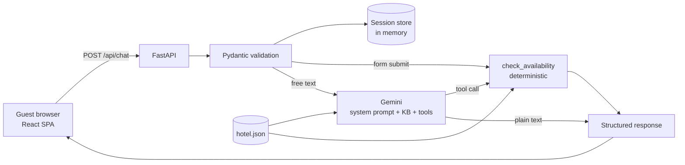

# Architecture

## Overview

## Frontend

- Single-page React app (Vite, TypeScript, Tailwind). `useChat` owns the conversation state, session id (kept in `sessionStorage`), loading state and retry logic.
- `api/client.ts` is the only code that talks to the network. It calls the backend only, applies a 30 s timeout and maps failures to typed errors (`network`, `timeout`, `validation`, `server`).
- The UI renders by response `type`: normal bubble, room cards, availability form, fallback highlight, or error card with retry.
- No API key or model call exists in the frontend. The Vite dev proxy forwards `/api` to the backend.

## Backend

| Module | Responsibility |
|---|---|
| `main.py` | Routes, CORS, request-id middleware, structured error handlers, request logging |
| `schemas.py` | Request/response models and input validation (dates, guest count, message length) |
| `chat_service.py` | Orchestration: form path vs LLM path, tool-result mapping, fallbacks, history |
| `llm_client.py` | Gemini wrapper behind a small interface, timeouts and error mapping, `FakeLLM` for tests |
| `prompts.py` | System prompt (grounding rules) and the three tool definitions |
| `knowledge.py` | Loads `hotel.json` and renders it as prompt context |
| `availability.py` | Deterministic `check_availability` with mock bookings and pricing |
| `session_store.py` | In-memory conversation history with TTL and size limits |

## Request flow

1. **Form submission** (`availability` present): validate, run `check_availability`, build the message from a template, return `type: availability`. The LLM is not involved.
2. **Free-text question:** load the session history and call Gemini with the system prompt (rules plus full hotel data) and three tools:
   - no tool call, plain text → `answer`
   - `check_availability` → dates and guests are validated again, then the deterministic function runs → `availability`
   - `ask_for_availability_details` → `needs_input` with the missing fields
   - `cannot_answer` (or an unknown tool, or empty output) → `fallback`
3. Model timeout or provider failure → `type: error` with a friendly message. The failed turn is not saved to history.
4. Every response carries a `request_id` (also in the `X-Request-ID` header) that matches the log lines.

## Data

`hotel.json` holds the property details, policies, breakfast, amenities, rooms and FAQs. It is small enough to pass in full as context, so there is no retrieval layer. Room prices and capacities are also read by the availability function, so there is a single source of truth.

## Deployment

Frontend is a static Vite build on Vercel. Backend is a FastAPI service on Render. The browser calls the backend directly using `VITE_API_BASE_URL`, and the backend allows only the frontend origin through `ALLOWED_ORIGINS`. Secrets live only in Render's environment.